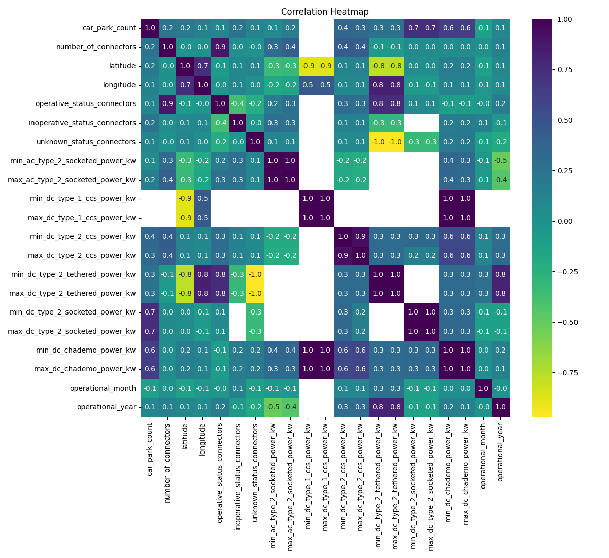
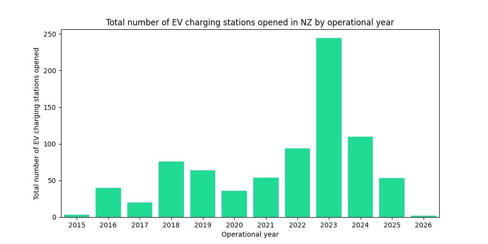
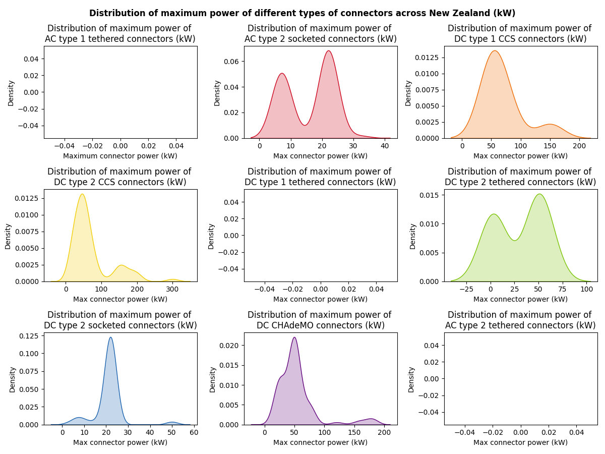
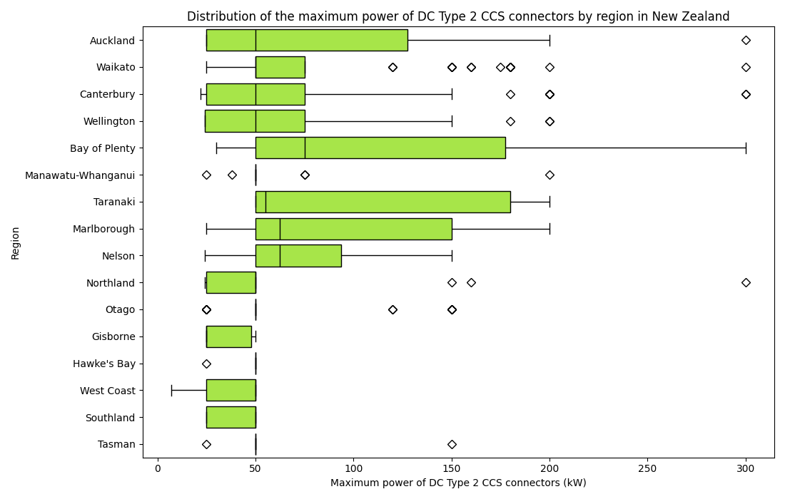

# Data Analysis of EV charging stations in New Zealand🔋🔌

  
  
  

## Dataset
- Source: New Zealand Transport Agency (NZTA)
- Source URL: https://opendata-nzta.opendata.arcgis.com/datasets/NZTA::ev-roam-charging-stations/about

## Kaggle Notebook📓
https://www.kaggle.com/code/reshmaharidhas/data-cleaning-eda-of-ev-charging-stations-in-nz

## Tech stack💻
- Pandas
- Seaborn
- Matplotlib
- Python
- Numpy

## Visualizations🔌

## Insights🔋

## License💻
MIT
