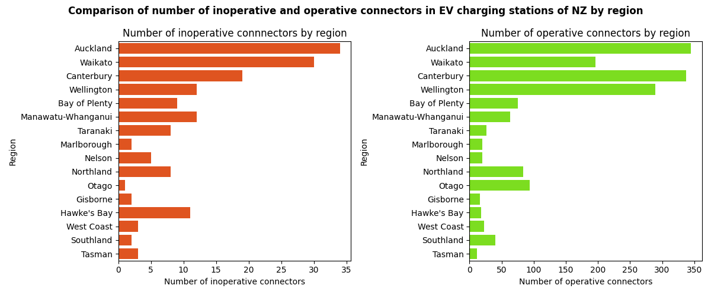

# Data Analysis of EV charging stations in New Zealand🔋🔌
This project analyses the distribution of EV charging stations across New Zealand, finds the connectors with maximum power in all regions of New Zealand, identifies the EV charging stations having fast charging DC connectors, the current EV charging networks, Charge Point Operators, AC and DC connectors, and charging stations with parking fees and charging fees. The goal is to clean the dataset, perform exploratory data analysis, create data visualizations, and find insights from the cleaned dataset.

  
  
  
  
  

## Dataset
- Source: New Zealand Transport Agency (NZTA)
- Source URL: https://opendata-nzta.opendata.arcgis.com/datasets/NZTA::ev-roam-charging-stations/about

## Kaggle Notebook📓
https://www.kaggle.com/code/reshmaharidhas/data-cleaning-eda-of-ev-charging-stations-in-nz

## Tech stack💻
- Pandas
- Seaborn
- Matplotlib
- Python
- Numpy

## Visualizations🔌

## Insights🔋
- Auckland has the highest number of EV charging stations, because of the highest population in the Auckland region.
- North island has more number of EV charging stations than the South island, indicating that the distribution of population is high in North island, and EV adoption is high.
- DC connectors are widely used than AC connectors in New Zealand, indicating that travelling to long distance is not a hassle because of fast charging DC connectors in stations.
- Most of the EV charging stations have free parking which shows there is much convenience for EV users.
- The fastest charging connector in the EV charging stations of New Zealand is DC Type 2 CCS connector with a maximum of 300 kW power, and more than 450 stations have it. This shows there is good infrastructure for EV buyers in New Zealand, which can further increase the sales of electric vehicles in New Zealand.
- More than 90% of EV charging stations in New Zealand has no maximum time limit for charging, which makes the EV users worry-free to access and charge their vehicles anytime.
- ChargeNet NZ is the major player as the Charge Point Operator, because the number of EV charging stations and connectors powered by ChargeNet NZ is higher. It indicates that ChargeNet NZ has a strong market presence in the EV sector.
- The regions of South island such as Tasman, Nelson, Gisborne has less number of EV charging stations which suggests EV expansion opportunities for new companies in the South island.
- The fastest charging DC connectors such as Type 2 CCS and CHAdeMO with 300 kW power is present in 4 regions in the North island, but only Canterbury region in the South island has the highest power connectors. This highlights the gap in fast charging environment for the other regions in the South island.
- The number of inoperative connectors are high in Auckland, Waikato, and Canterbury regions, which reflects that EV users in highly populated regions like Auckland can have some issues in few EV charging stations and those connectors needs to be repaired and maintained.
The number of EV charging stations opened in 2023 is very high than between the years 2016 and 2022, which indicates that the number of electric vehicle users has significantly increased from the year 2023 in New Zealand.

## License💻
MIT
